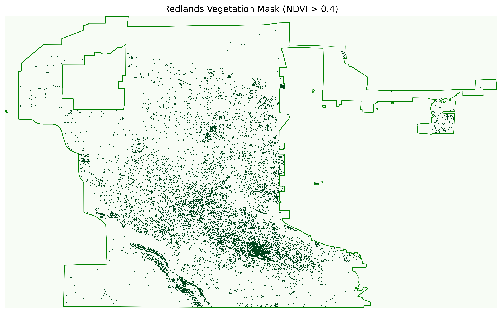
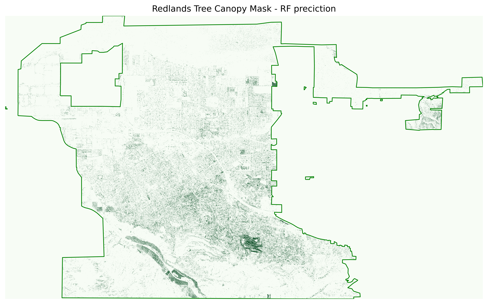
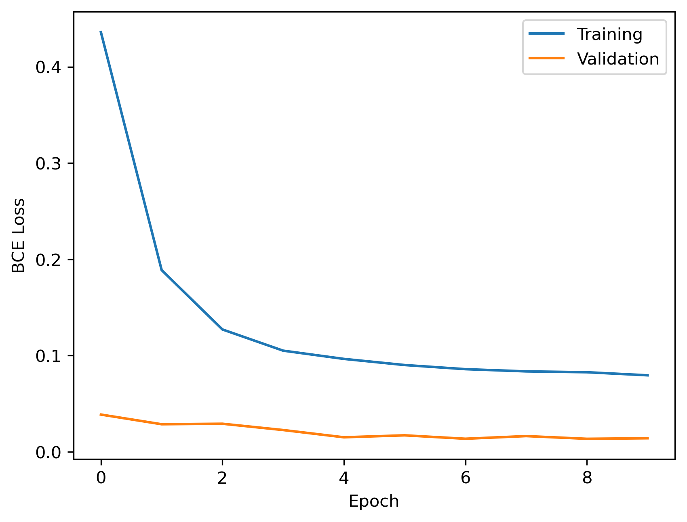
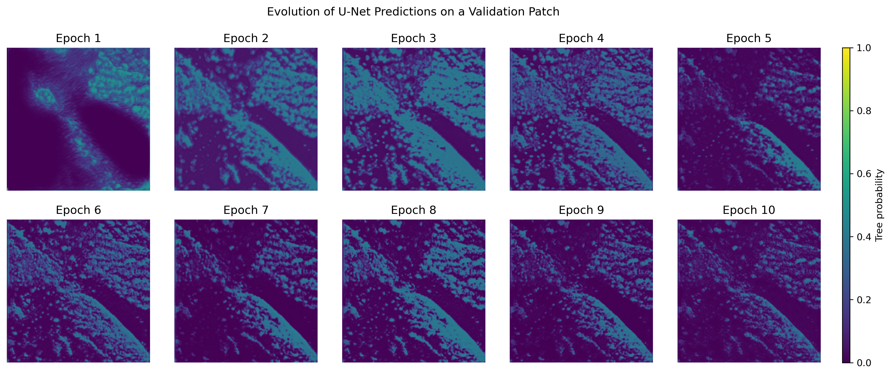
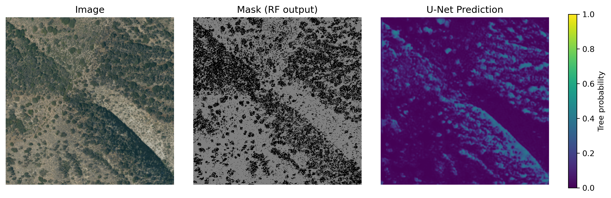

# Urban_Tree_Canopy_Detection
Tree canopy detection in urban area using NAIP imagery, Random Forest classification, and deep learning segmentation.

### Data Source

- **National Agriculture Imagery Program (NAIP)**
- **4-band imagery**: Red, Green, Blue, Near-Infrared (RGB + NIR)
- **Spatial resolution**: ~1 meter
- **Study area**: One U.S. city, covered by 8 NAIP tiles

## NDVI-Based Vegetation Mask
This project begins with a baseline vegetation detection approach using the Normalized Difference Vegetation Index **(NDVI)**.

#### Notebooks
`get_binarymask_ndvi.ipynb`   
`overlay_ndvi_redlands_raster.ipynb`

#### What they do
- Loads NAIP raster tiles
- Computes NDVI using the Red and Near-Infrared (NIR) bands
- Applies a threshold to create a binary vegetation mask
- Saves per-tile NDVI rasters and vegetation masks

#### Outputs
- The notebook creates an output folder `get_binarymask_outputs/`
- Include:
  - NDVI GeoTIFFs
  - Binary vegetation mask GeoTIFFs
- A stitched, city-wide visualization:
  - `Redlands_Vegetation_NDVI_NAIP.png`
 
This step provides an interpretable but coarse baseline for vegetation classification.

## Manual Labeling

#### Patch Extraction
- A single NAIP tile was selected (out of 8 tiles total)
- The tile was divided into **512 × 512 pixel-patches**

#### Manual Labeling
- **12 patches** were manually labeled in **QGIS** (GUI-based workflow)
- Binary classification scheme:
  - **1** = Tree canopy
  - **0** = Non-tree
- In `labeled_data` folder

## Random Forest Tree Canopy Classifier

A **Random Forest** classifier was trained using a portion of the manually labeled patches against **pixel-level features** from the NAIP imagery (mainly the RGB and NIR values; did not use NDVI here, though the study can be extended to include NDVI or other indices and compare perfomance of RF classifications with these added features). 

#### Script
`rf_canopy_classifier.py`

#### Model Details
- **Input features:**
  - NAIP spectral bands (RGB + NIR)
- **Training data:**
  - Pixels from 12 manually labeled patches (80% training set, 20% test set)
- **Output:**
  - Binary masks of tree canopy prediction

#### Output
- **Predicted masks** for all NAIP tiles and all patches:
  - `data/patches/rf_predictions/`
    
#### Notebook
`stitch_rf_prediction_patches.ipynb`
   
#### Output
- **City-wide stitched visualization:**
  - `treeCanopy_RFprediction.png`

   
The RF classifier performs a **semi-automatic labeling process**. Here it used to generate tree labels which approximate tree canopy for the entire NAIP imagery dataset covering the study area, which is far larger than could realisticall be labeled manually. 

   
Note that RF predictions can still be spatially noisy due to pixel-based classification. The goal is to use these as trainig labels for a U-Net segmentation model, thus reducing label noise is important. Incorrect or uncertain labels can degrade the performance of the segmentation model. 

## High-Confidence RF Classifier

#### Script
 `rf_canopy_highconfidence_classifier.py`

To improve the quality of the RF predictions (reduce label noise), we modify the classifier to label pixels by high-confidence and produce pseudo-label masks.  
For each input imagery patch, and for each pixel, the high-confidence classifier computes class probabilities representing the likelihood that the pixel belongs to tree canopy. Pixels with probability greater than 0.9 are labeled as tree (1), while pixels with probability below 0.1 are labeled as non-tree (0). Pixels with intermediate probabilities are considered uncertain and assigned a value of −1.

| Pixel Value | Meaning |
|-------------|---------|
| **1** | High-confidence Tree |
| **0** | High-confidence Non-Tree |
| **−1** | Uncertain prediction (ignored later) |
   

## Selecting U-Net Training Samples

#### Script
`select_unet_trainingset.ipynb`

The high-confidence masks are further filtered to identify image patches suitable for U-Net training.
A patch is retained if 

- more than 1% of the mask pixels are labeled as high-confidence tree (1) and, 
- fewer than 40% of the mask pixels are labeled as uncertain (-1)

These criteria remove patches containing too little canopy information or excessive uncertainty, resulting in **47  high-quality training patches**. The minimum tree coverage threshold was chosen to help retain a sufficient number of training samples.

## U-Net Training
A U-Net convolutional neural network (implemented with segmentation_models_pytorch) was trained for binary semantic segmentation of tree canopy. The network used a ResNet-18 encoder with three-channel RGB imagery as input and produced a per-pixel probability of tree canopy. Of the 47 high-quality patches, the training/validation split was set at 80%/20%.
   
- Loss function: BCEWithLogitsLoss   
- Optimizer: Adam with fixed learning rate
     

  

    
## Current Status and Next Steps

#### Current Focus
- U-Net implementation on untrained data.
- output map

  
